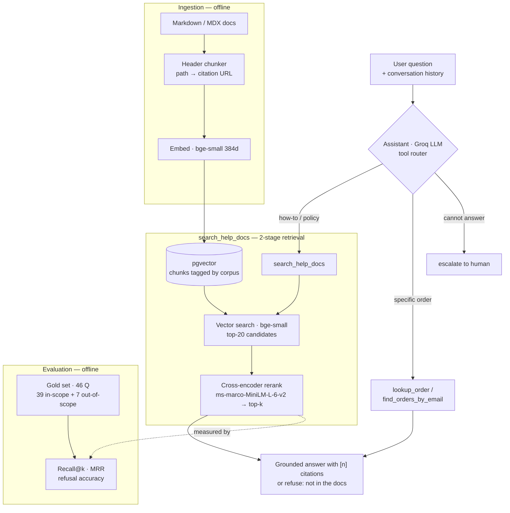

# CITE — a grounded, evaluated RAG assistant

**CITE** answers questions from a documentation corpus with **grounded citations**,
explicit **"I don't know" handling** (no hallucinated answers), and a
**retrieval evaluation harness** that measures answer quality with real numbers.

> Portfolio project demonstrating end-to-end AI application engineering:
> document ingestion → chunking → embeddings → vector search → grounded
> generation → evaluation → deployment.

## Why this exists

Most "chat with your docs" demos stop at "it replies." The hard parts of RAG are
the **retrieval** and **honesty** layers — this project focuses there:

- Every answer cites the exact source doc/section it came from.
- When the docs don't contain the answer, it says so instead of guessing.
- A held-out Q&A eval set measures retrieval hit-rate and no-answer accuracy.
- Retrieved chunks are inspectable (you can see *why* it answered).

The current corpus is the **public [Medusa](https://medusajs.com) merchant
user-guide** (an open-source e-commerce platform) — i.e. the kind of store-admin
help docs a shop runs a customer-support desk over: orders, returns, exchanges,
products, inventory, promotions, shipping. The pipeline is domain-agnostic and
**multi-corpus**: each ingested doc set is tagged with a `corpus` id, search can
be scoped to one, and the UI exposes a knowledge-base selector. One corpus
(Medusa) is loaded today; adding another is just pointing the ingester at a
different set of Markdown docs (`python ingest/embed_and_store.py <corpus>`).
Additional evaluated corpora are planned.

## Stack

| Layer | Choice |
|-------|--------|
| Ingestion | Python — header-based chunking of Markdown/MDX docs (path → citation URL) |
| Embeddings | `fastembed` · `BAAI/bge-small-en-v1.5` (384-dim, local, no API key) |
| Vector store | pgvector (Postgres) · HNSW cosine index |
| LLM | Groq · `llama-3.3-70b-versatile` (OpenAI-compatible API) |
| Backend | FastAPI *(in progress)* |
| Frontend | React — chat UI + source/trace panel *(in progress)* |
| Eval | Python harness — Recall@k, MRR, refusal accuracy (46-question gold set) |
| Deploy | Docker → Fly.io / Render *(planned)* |

## Architecture

Every retrieval is inspectable in the demo UI (raw vector rank vs. reranked
order, with both scores), so you can see *why* an answer was given — not just the
answer. The retrieval, order-lookup, and eval paths run with **no LLM**; only the
final answer composition calls Groq.

## Evaluation

Retrieval and honesty are measured, not asserted. The gold set (`eval/gold_set.json`)
is 46 questions written the way a store operator actually asks them: **39 in-scope**
(each labeled with the doc that answers it) and **7 out-of-scope** (the assistant
should refuse). `eval/run_eval.py` reports two things:

- **Retrieval** — does the correct doc appear in the top-k? (Recall@k, MRR). No LLM
  needed, so this number is free and deterministic.
- **Honesty** — are out-of-scope questions refused (not answered), and are real
  questions wrongly refused (over-refusal)?

### Before → after: adding a cross-encoder reranker

Error analysis on the first run showed the failures were a *ranking* problem, not a
recall problem: the bi-encoder (bge-small) retrieved the right neighborhood but was
fooled by surface word collisions (e.g. a "bulk import" query pulled the *Bulk Editor*
and *Export* docs above *Import Products*). The fix: retrieve the top-20 candidates by
vector, then re-score them with a cross-encoder (`ms-marco-MiniLM-L-6-v2`) that reads
the query and each chunk *together*.

| Metric | Bi-encoder only | + Cross-encoder reranker |
|---|---|---|
| Recall@1 | 69.2% | **76.9%** |
| Recall@3 | 94.9% | **97.4%** |
| Recall@5 | 94.9% | **100.0%** |
| MRR | 0.816 | **0.861** |
| Retrieval failures (correct doc not in top-5) | 2 | **0** |
| Out-of-scope refusal accuracy | 100% (7/7) | 100% (7/7) |
| Over-refusal (real questions refused) | 5.1% | **2.6%** |

The reranker eliminated both retrieval failures. **One question still fails, on
purpose kept in the report**: "how do I *add* a new customer" — the docs say
"*create* a customer", an add/create vocabulary gap. The correct doc reaches the
top-5 but the *create-customer* section isn't the retrieved chunk, so the assistant
**refuses instead of answering from the wrong section**. That is the safe failure;
closing it (query expansion / chunk-level scoring) is a tracked next step, not a
number hidden by overfitting the gold set.

Reproduce: `python eval/run_eval.py` (set `RAG_RERANK=0` for the baseline column;
`EVAL_SKIP_LLM=1` for retrieval metrics only, no LLM calls).

## Status

🚧 In progress — see `PLAN.md` for scope and the current step.
Done: RAG loop (ingest → cited answers + no-answer handling), eval harness with
before/after numbers, cross-encoder reranker, order-lookup tool with agentic
routing, and a demo web UI with inspectable retrieval traces, multi-turn
conversation, and a multi-corpus knowledge-base selector.
Next: a second evaluated corpus and live deployment.

## Data source note

Uses the **public** Medusa documentation (MIT-licensed) for a portfolio demo
only. Content is not redistributed commercially.
